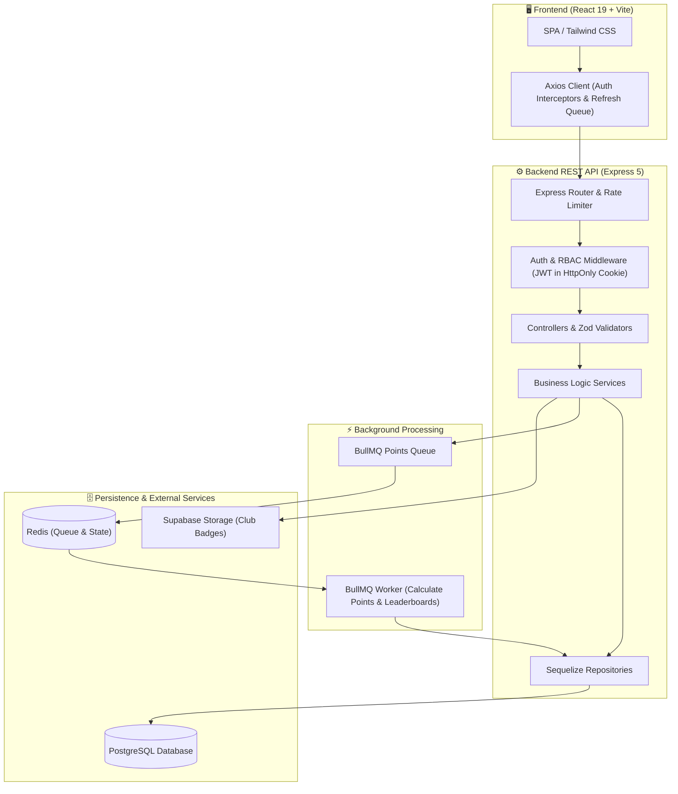

# 🏉 URBA Prode — Rugby Tournament Prediction Platform

[](https://nodejs.org/)
[](https://expressjs.com/)
[](https://react.dev/)
[](https://vitejs.dev/)
[](https://www.postgresql.org/)
[](https://redis.io/)
[](https://tailwindcss.com/)
[](LICENSE)

Plataforma full-stack de pronósticos deportivos diseñada específicamente para la estructura de torneos de la **Unión de Rugby de Buenos Aires (URBA)**. Permite a los usuarios predecir resultados fecha a fecha, competir en tablas generales, crear grupos privados entre amigos o compañeros de club y seguir estadísticas en tiempo real.

---

## 📌 Particularidades del Dominio

A diferencia de los deportes tradicionales con un único partido por fecha entre dos clubes, en el rugby de la URBA cada jornada entre dos instituciones (por ejemplo, *CASI vs. SIC*) involucra múltiples categorías disputadas en simultáneo:

* 🥇 **Primera División**
* 🥈 **Intermedia**
* 🥉 **Preintermedia A (Pre A)**
* 🏅 **Preintermedia B (Pre B)**
* 🎖️ **Preintermedia C (Pre C)**

El sistema modela esta relación jerárquica para generar y sincronizar fixtures en bloque, permitiendo pronósticos y tablas de clasificación independientes pero unificadas por jornada.

### 🎯 Reglas de Puntuación
* **3 puntos**: Acertar el ganador del partido (`Local`, `Empate` o `Visitante`).
* **0 puntos**: Pronóstico incorrecto.
* **Bloqueo Automático**: Cierre estricto de pronósticos al horario programado de inicio de cada partido.
* **Cálculo Desacoplado Asíncrono**: Procesamiento masivo de puntajes y tablas mediante workers en segundo plano (**BullMQ + Redis**) al cargar el resultado oficial.

---

## 🏗️ Arquitectura del Sistema



---

## 🛠️ Stack Tecnológico

### Backend (`prode-back`)
* **Runtime**: Node.js (ES Modules).
* **Framework Web**: Express 5.
* **Base de Datos & ORM**: PostgreSQL con Sequelize 6 (pool de conexiones configurado, transacciones ACID y convención snake_case).
* **Procesamiento en Segundo Plano**: BullMQ + ioredis para cálculo asíncrono no bloqueante de puntuaciones masivas.
* **Seguridad & Autenticación**:
  * JWT emitido en cookies `HttpOnly` y `Secure`.
  * Hashing de contraseñas con `bcryptjs` (salt rounds 10).
  * Control de acceso basado en roles (**RBAC**) con middleware `authorizeAdmin`.
  * Rate limiting con `express-rate-limit`.
  * Prevención de IDOR en guardado de pronósticos forzando el `req.user.id`.
* **Validación de Datos**: Schemas estrictos con Zod.
* **Testing**: Suite de pruebas unitarias sobre el runner nativo de Node.js (`node --test`).

### Frontend (`prode-front`)
* **Framework**: React 19 con Vite 6 (SWC).
* **Estilos**: Tailwind CSS v4 con paleta personalizada y soporte Dark/Light mode.
* **Enrutamiento**: React Router v7 con lazy loading y guardias de navegación (`ProtectedRoute`, `AdminRoute`, `PublicRoute`).
* **Componentes & UI**: Radix UI Tabs, Lucide React, React Toastify.
* **Cliente HTTP**: Axios centralizado con cola de reintentos (`failedQueue`) para rotación automática de refresh token ante errores `401 Unauthorized`.

---

## 📁 Estructura del Monorepo

```
prode/
├── prode-back/                     # API REST, Modelos y Workers
│   ├── src/
│   │   ├── config/                 # Conexión DB (Sequelize), Redis y Supabase
│   │   ├── controller/             # Controladores HTTP
│   │   ├── middlewares/            # authenticate (JWT), authorize (RBAC), rate limiter
│   │   ├── models/                 # Modelos Sequelize y grafo de asociaciones
│   │   ├── queues/                 # Definición de colas BullMQ
│   │   ├── repositories/           # Queries y abstracción de acceso a datos
│   │   ├── routes/                 # Enrutamiento modular por recurso
│   │   ├── schemas/                # Validaciones con esquemas Zod
│   │   ├── services/               # Lógica de negocio y cálculo de métricas
│   │   ├── utils/                  # Cookies, respuestas y helpers
│   │   ├── workers/                # Workers independientes de BullMQ
│   │   └── index.js                # Punto de entrada de la aplicación Express
│   ├── tests/                      # Suite de tests unitarios (Node.js test runner)
│   ├── .env.example                # Plantilla de variables de entorno para backend
│   └── package.json
│
├── prode-front/                    # Single Page Application (SPA)
│   ├── src/
│   │   ├── components/             # Componentes modulares (Admin, Dashboard, Fixture, UI)
│   │   ├── context/                # AuthContext y ThemeContext
│   │   ├── hooks/                  # Custom hooks (toasts, estado)
│   │   ├── pages/                  # Vistas principales de la aplicación
│   │   ├── services/               # Clientes y llamadas a la API
│   │   ├── App.jsx                 # Configuración de rutas y contextos
│   │   └── main.jsx                # Entry point de React
│   ├── .env.example                # Plantilla de variables de entorno para frontend
│   ├── vite.config.js
│   └── package.json
│
├── package.json                    # Scripts del Monorepo
├── .gitignore                      # Reglas de exclusión globales (secrets, node_modules, dist)
└── README.md                       # Documentación principal
```

---

## 🚀 Puesta en Marcha en Desarrollo

### 1. Prerrequisitos
* **Node.js**: `>= 18.0.0`
* **PostgreSQL**: `>= 14`
* **Redis**: `>= 6.0` (o instancia Cloud como Upstash)

### 2. Clonar el Repositorio
```bash
git clone https://github.com/Stefanopellegrinoo/prode.git
cd prode
```

### 3. Configuración del Backend (`prode-back`)
```bash
cd prode-back
npm install

# Copiar plantilla de variables de entorno
cp .env.example .env
```

Completar los valores en `prode-back/.env`:
```env
PORT=3000
NODE_ENV=development

# PostgreSQL
DB_HOST=localhost
DB_PORT=5432
DB_NAME=prode_urba
DB_USER=postgres
DB_PASS=tu_password
DB_SSL=false

# Autenticación JWT
JWT_SECRET=tu_clave_secreta_jwt
JWT_REFRESH_SECRET=tu_clave_secreta_refresh_jwt

# Redis (BullMQ)
REDIS_HOST=127.0.0.1
REDIS_PORT=6379
REDIS_USERNAME=default
REDIS_PASSWORD=

# Supabase Storage (Logos de clubes)
SUPABASE_URL=https://tu-proyecto.supabase.co
SUPABASE_SERVICE_ROLE_KEY=tu_supabase_service_role_key
```

Iniciar el servidor backend:
```bash
npm run dev
```

*(Opcional / Recomendado)* Iniciar el worker de cálculo de puntos en un proceso separado:
```bash
npm run dev:worker
```

### 4. Configuración del Frontend (`prode-front`)
```bash
cd ../prode-front
npm install

# Copiar plantilla de variables de entorno
cp .env.example .env
```

Iniciar el servidor de desarrollo de Vite:
```bash
npm run dev
```
La aplicación quedará disponible en `http://localhost:5173`.

---

## 🧪 Testing y Calidad de Código

El backend cuenta con una suite de pruebas unitarias implementada con el test runner nativo de Node.js (`node --test`), sin dependencias pesadas de testing:

```bash
cd prode-back
npm test
```

### Cobertura de Pruebas:
* 🛡️ **Seguridad & Autenticación**: Hashing bcrypt, schemas de validación de registro y login.
* 🔒 **Control de Acceso (RBAC)**: Validación de permisos de administrador y rechazo de accesos no autorizados.
* 🛑 **Prevención de IDOR**: Validación de inyección de `userId` en pronósticos forzando identidad del token.
* 🏆 **Lógica de Grupos y Puntos**: Permisos de creador de grupo y asignación de puntajes por partido.

---

## 📄 Licencia

Distribuido bajo la Licencia [ISC](LICENSE).
